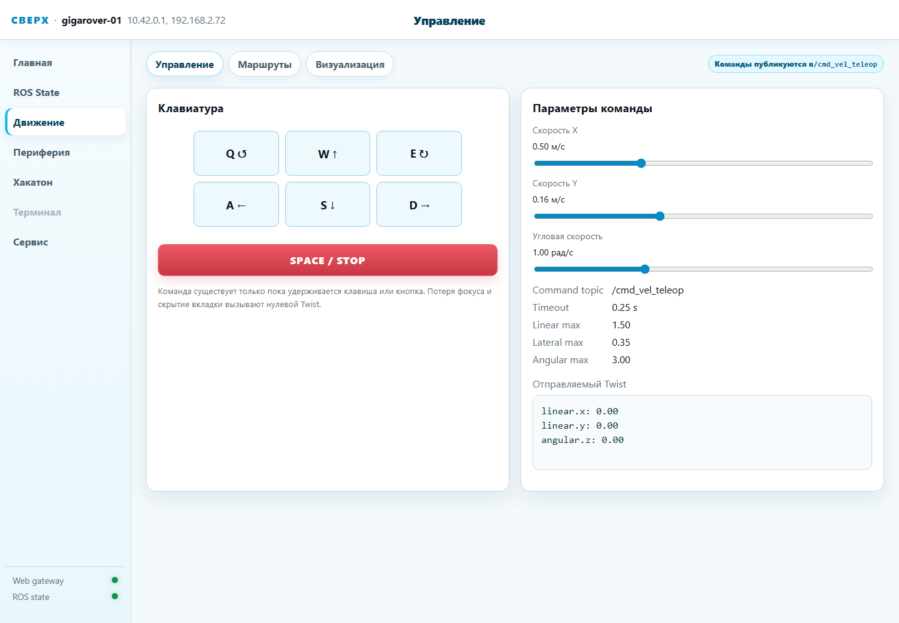
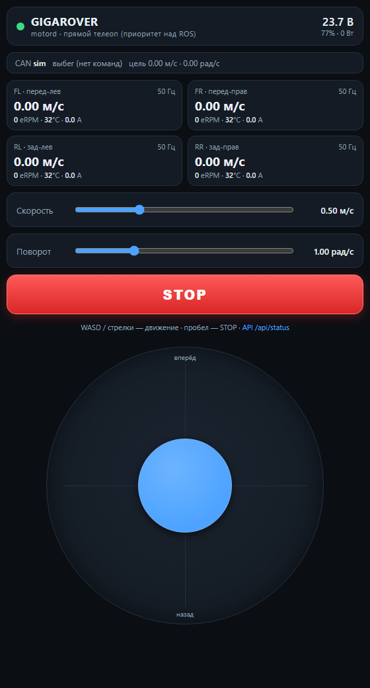
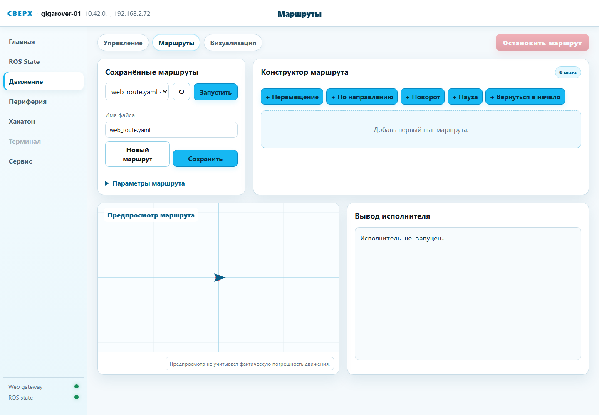

# Как ездить на GIGAROVER

Все способы управления ровером — от джойстика на телефоне до собственных
программ. Рабочий код каждого способа лежит в [examples/](../examples/).

## Как устроено управление

Единственный владелец CAN-шины и моторов — демон `rover-motord`
(работает всегда, ROS ему не нужен). Все пути команд сходятся в него:

```
телефон / браузер ────────── HTTP :8767 ──────────────┐
                                                      │  источник web
скрипты по сети ──── HTTP :8765 ─┐                    │  (приоритет)
                                 │                    ▼
веб-морда (страница  ────────────┤              ┌───────────┐    CAN 500k
«Движение»)                      ▼              │rover-motord│──► 4 × VESC
                        /cmd_vel_teleop (100)   │  50 Гц,   │    (SET_RPM)
Nav2 ──► /cmd_vel_nav (50) ──► twist_mux ──►    │  deadman, │
ваши скрипты ──► /cmd_vel_test (75)  │          │  арбитраж │
                                     ▼          └───────────┘
                                 /cmd_vel ──► vesc_bridge_node ── UDP :8460
                                              (источник ros)
```

Два уровня приоритетов:

1. **Внутри ROS** — `twist_mux` выбирает самый приоритетный живой
   источник `/cmd_vel`: телеоп (100) > тестовые скрипты (75) > Nav2 (50).
2. **В демоне** — источник `web` (телефон на :8767) перехватывает
   управление у `ros` в любой момент. Телефон всегда главнее автономки.

**Дедмены везде.** Источник замолчал на 0.25–0.5 с — моторы отпускаются
(коаст). Поэтому «одна команда» никуда не едет: любой программный способ —
это **поток команд 10–20 Гц** и явный стоп в конце. Аварийный стоп
(`STOP` в веб-мордах, `/api/stop`, `estop`) дополнительно блокирует
движение на 0.75 с для всех источников.

## Сеть: как достучаться до ровера

| Подключение | Адрес | Комментарий |
| --- | --- | --- |
| Wi-Fi точка ровера, SSID `GIGAROVER`, пароль `gigarover` | `10.42.0.1` (алиас `rover.go`) | основной способ на выезде; DHCP раздаёт сам ровер |
| Ethernet / локальная сеть | IP от роутера, mDNS `gigarover-01.local` | в мастерской |
| SSH | `ssh ubuntu@10.42.0.1` | для способов, работающих «на борту» |

Что доступно откуда:

| Способ | С телефона/ПК по сети | На борту (SSH) |
| --- | --- | --- |
| Веб-морда :8765, аварийный телеоп :8767, HTTP API | ✅ | ✅ |
| Топики ROS 2, `ros2 topic pub`, rclpy | ❌ (DDS заперт в localhost) | ✅ |
| UDP API демона :8460 | ❌ (слушает 127.0.0.1) | ✅ |

> **Почему топики не видны с ПК:** на ровере выставлен
> `ROS_AUTOMATIC_DISCOVERY_RANGE=LOCALHOST` (в `/etc/default/rover-bringup`) —
> DDS-трафик по Wi-Fi ронял управление, наружу смотрит только HTTP.
> Снимать это ограничение на соревнованиях не рекомендуем; программный
> доступ извне — через HTTP API (способ 3).

## Способ 1. Веб-морда ROS-стека — `http://10.42.0.1:8765`

Основной интерфейс (пакет `rover_web`). Открывается с телефона и ПК,
ничего ставить не нужно. Страница **«Движение» → «Управление»**:



- на ПК — клавиши **WASD** (W/S — вперёд/назад, A/D — курс, Q/E —
  разворот на месте), **пробел — STOP**; команда живёт, только пока
  клавиша удержана;
- на телефоне — экранный джойстик;
- ползунки задают скорости: до 1.5 м/с и 3.0 рад/с;
- команды публикуются в `/cmd_vel_teleop` (приоритет 100 — перебивает
  Nav2 и скрипты);
- потеря фокуса вкладки = нулевая команда (защита от «убежал с открытой
  вкладкой»).

Здесь же вкладки **«Маршруты»** (способ 6) и **«Визуализация»**
(одометрия на плоскости), остальные разделы — телеметрия, периферия,
диагностика: см. [web_interfaces.md](web_interfaces.md).

## Способ 2. Аварийный телеоп — `http://10.42.0.1:8767`

Веб-морда самого демона `rover-motord`. **Работает даже при полностью
лежачем ROS-стеке** и имеет высший приоритет: джойстик на :8767
перехватывает управление у всего, что едет через ROS (источник `web` >
`ros`). Отпустили джойстик — через 0.5 с управление возвращается.



Джойстик, слайдеры скоростей, большая кнопка STOP (блок 0.75 с), живая
телеметрия всех четырёх колёс (м/с, eRPM, температура, ток), напряжение
и заряд батареи, состояние CAN-линка. На ПК — WASD/стрелки, пробел — STOP.

Это же — резервный канал: если веб-морда :8765 не открывается, :8767
почти наверняка жив (демон перезапускается systemd-watchdog'ом сам).

## Способ 3. HTTP API — свой код с любого устройства

Оба веб-сервера (шлюз :8765 и демон :8767) принимают одинаковые формы —
код переносится сменой порта. Доступно с телефона, ноутбука, другого
робота — из любой сети, где виден ровер.

| Запрос | Что делает |
| --- | --- |
| `POST /api/drive/command` тело `{"linear_x": 0.4, "angular_z": 0.0}` | команда движения (м/с, рад/с) |
| `POST /api/drive/stop` | мягкий стоп |
| `POST /api/stop` | аварийный стоп + блок 0.75 с |
| `GET /api/status` | телеметрия (форматы :8765 и :8767 различаются) |
| `GET /api/drive` | лимиты, дефолты, последняя команда |
| `GET /api/health` | живость сервиса |

Помните про дедмен — команды слать потоком:

```bash
# поехали: 20 команд в секунду, 2 секунды, затем стоп
for i in $(seq 1 40); do
  curl -s -X POST http://10.42.0.1:8765/api/drive/command \
       -H 'Content-Type: application/json' \
       -d '{"linear_x": 0.4, "angular_z": 0.0}' > /dev/null
  sleep 0.05
done
curl -s -X POST http://10.42.0.1:8765/api/drive/stop
```

Готовые скрипты (чистый Python, без зависимостей):

```bash
python3 examples/http_drive.py forward --speed 0.4 --duration 2
python3 examples/http_drive.py square --side 1.0
python3 examples/http_status.py --watch
```

Разница портов: :8765 идёт путём `/cmd_vel_teleop` → twist_mux → мост →
демон (нужен живой ROS-стек), :8767 — сразу в демон с приоритетом `web`
(работает всегда, перебивает ROS).

## Способ 4. ROS 2: топики `cmd_vel` (на борту)

Полноценный ROS 2 Jazzy — для своих узлов, автономии, интеграции с Nav2.
Запускается на ровере по SSH:

```bash
ssh ubuntu@10.42.0.1
source /opt/ros/jazzy/setup.bash
source ~/rover_ws/install/setup.bash
```

Разовая проверка (дедмен отпустит через полсекунды после Ctrl+C):

```bash
ros2 topic pub -r 20 /cmd_vel_teleop geometry_msgs/msg/Twist \
  "{linear: {x: 0.4}, angular: {z: 0.0}}"
```

Телеоп с клавиатуры (в комплекте ROS, ставится отдельно:
`sudo apt install ros-jazzy-teleop-twist-keyboard`):

```bash
ros2 run teleop_twist_keyboard teleop_twist_keyboard \
  --ros-args -r cmd_vel:=/cmd_vel_teleop
```

Свой узел на rclpy — [examples/ros2_cmd_vel.py](../examples/ros2_cmd_vel.py):

```bash
python3 ~/rover_ws/examples/ros2_cmd_vel.py --vx 0.4 --duration 2
python3 ~/rover_ws/examples/ros2_cmd_vel.py --wz 1.0 --duration 1.6
```

**Куда публиковать:**

| Топик | Приоритет | Для чего |
| --- | --- | --- |
| `/cmd_vel_teleop` | 100 | ручное управление — перебивает всё |
| `/cmd_vel_test` | 75 | **ваши программы** — джойстик всегда сможет перехватить |
| `/cmd_vel_nav` | 50 | сюда пишет Nav2, руками не публиковать |

Обратная связь для замкнутых контуров:

```bash
ros2 topic echo /odom              # фьюженная одометрия (EKF)
ros2 topic echo /wheel/encoders    # сырые энкодеры (тахометры VESC)
ros2 topic echo /battery/state     # батарея
ros2 topic echo /diagnostics       # здоровье VESC и CAN-линка
```

## Способ 5. UDP API демона (на борту, без ROS)

Самый низкий уровень: JSON-датаграммы прямо в контур 50 Гц демона,
`127.0.0.1:8460`. Подходит, когда ROS не нужен вовсе (свой стек, замеры,
отладка ходовой). Протокол — [tools/motord/README.md](../tools/motord/README.md):

```python
sock.sendto(b'{"v":1,"src":"ros","cmd":"drive","vx":0.4,"wz":0.0}',
            ("127.0.0.1", 8460))          # слать 10-20 раз в секунду
sock.sendto(b'{"v":1,"cmd":"sub"}', ...)  # подписка: state 50 Гц в ответ
```

Готовый клиент — [examples/udp_drive.py](../examples/udp_drive.py):

```bash
python3 ~/rover_ws/examples/udp_drive.py state      # смотреть телеметрию
python3 ~/rover_ws/examples/udp_drive.py forward --speed 0.4 --duration 2
```

## Способ 6. Маршруты: записал — поехал

Вкладка **«Движение» → «Маршруты»** веб-морды: конструктор шагов
(перемещение, движение по направлению, поворот, пауза, возврат в начало),
предпросмотр траектории, запуск/остановка, сохранение в YAML.



Исполнение — замкнутый контур по одометрии `/odom` (скрипт
`rover_motion_executor.py`), поэтому фигуры получаются точнее разомкнутых
примеров из способа 3. То же самое из консоли ровера (ROS-окружение
должно быть засорсено; топик указываем явно — по умолчанию скрипт пишет
в `/cmd_vel` мимо twist_mux):

```bash
EXEC=~/rover_ws/src/rover_web/tools/rover_motion_executor.py
python3 $EXEC --cmd-vel-topic /cmd_vel_test move --forward 1.0 --speed 0.25
python3 $EXEC --cmd-vel-topic /cmd_vel_test turn 90 --speed 0.5
python3 $EXEC --cmd-vel-topic /cmd_vel_test run \
    ~/.local/share/sverh-rover-web/plans/web_route.yaml
```

И то же — по HTTP (`POST /api/motion/start`):

```bash
curl -s -X POST http://10.42.0.1:8765/api/motion/start \
     -H 'Content-Type: application/json' \
     -d '{"kind": "move", "forward": 1.0, "speed": 0.25}'
curl -s -X POST http://10.42.0.1:8765/api/motion/stop
```

## Способ 7. Автономная навигация Nav2

Полная автономия по карте: SLAM-картография, локализация AMCL, планировщик.

```bash
# 1. Построить карту (профиль с лидаром и SLAM):
#    в /etc/default/rover-bringup выставить ROVER_PROFILE=gigarover_mapping
sudo systemctl restart rover-bringup
#    поездить телеопом по помещению (способ 1), затем сохранить:
ros2 run rover_navigation rover_map save моя_карта

# 2. Переключиться в навигацию:
#    ROVER_PROFILE=gigarover_navigation
sudo systemctl restart rover-bringup

# 3. Отправить цель (на борту; координаты в системе карты):
ros2 action send_goal /navigate_to_pose nav2_msgs/action/NavigateToPose \
  "{pose: {header: {frame_id: map}, pose: {position: {x: 2.0, y: 0.5}, orientation: {w: 1.0}}}}"
```

Управление картами: `ros2 run rover_navigation rover_map list|status|use <имя>`.
Nav2 публикует в `/cmd_vel_nav` (приоритет 50) — джойстик веб-морды в любой
момент перебивает автономку, а телефон на :8767 перебивает вообще всё.

Параметры Nav2/SLAM под GIGAROVER: `src/rover_bringup/config/navigation/
nav2_params_gigarover.yaml` и `slam_toolbox_params_gigarover.yaml`.

## Резерв. can_teleop — если сломалось всё остальное

Замороженный предшественник демона: один процесс = CAN-ходовая + веб-телеоп
на **:8765** (порт веб-морды, потому что ROS-стек при этом остановлен):

```bash
sudo systemctl start rover-can-teleop   # сам остановит motord и bringup
# ... телеоп на http://10.42.0.1:8765 ...
sudo systemctl start rover-motord rover-bringup   # вернуть штатный стек
```

## Техника безопасности

- Первый запуск любого нового кода — **колёса в воздухе, шасси на
  подставке**. Ровер тяжёлый и быстрый (до 1.5 м/с).
- Держите открытым аварийный телеоп `:8767` на телефоне — его STOP
  работает при любом состоянии ROS и перехватывает управление.
- Сверхмалые скорости недоступны: команды подпираются снизу порогом
  `min_erpm` (≈900 eRPM) — sensorless-моторы срываются на малых оборотах.
  Не закладывайтесь на движение медленнее ~0.2 м/с.
- Лимиты (1.5 м/с, 3.0 рад/с, токи VESC) настроены в конфигах — не
  поднимайте их без понимания последствий.
- После `/api/stop` (и кнопки STOP) движение блокируется на 0.75 с —
  это не бага, это защита.
