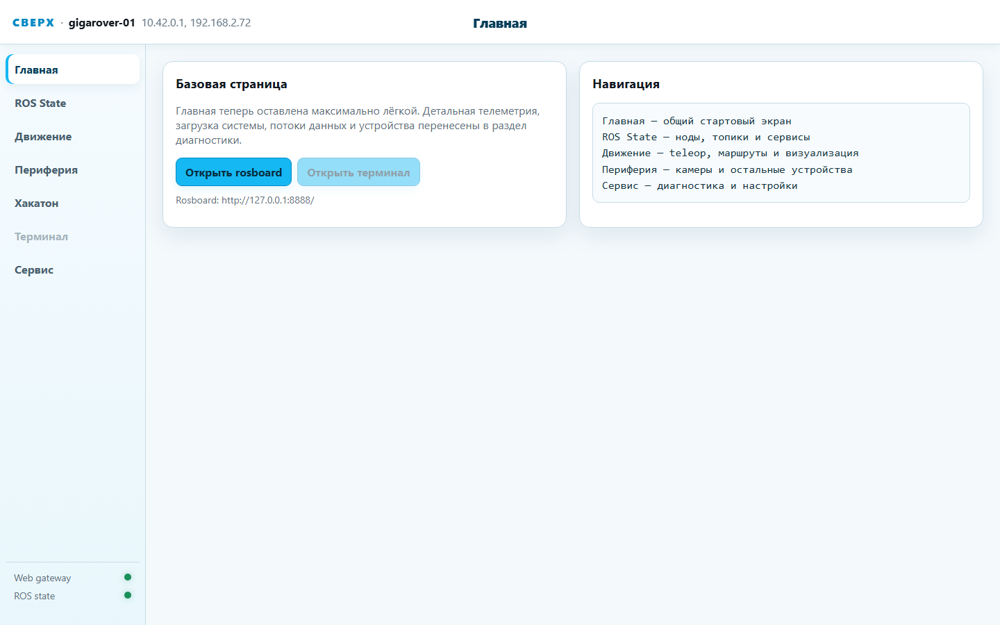
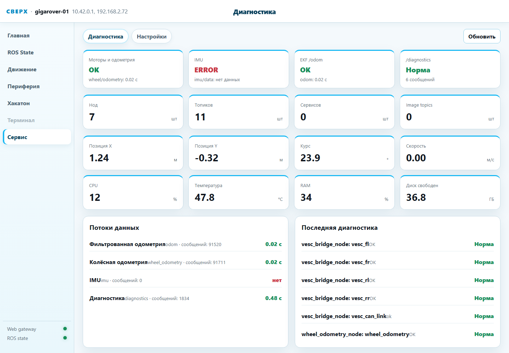
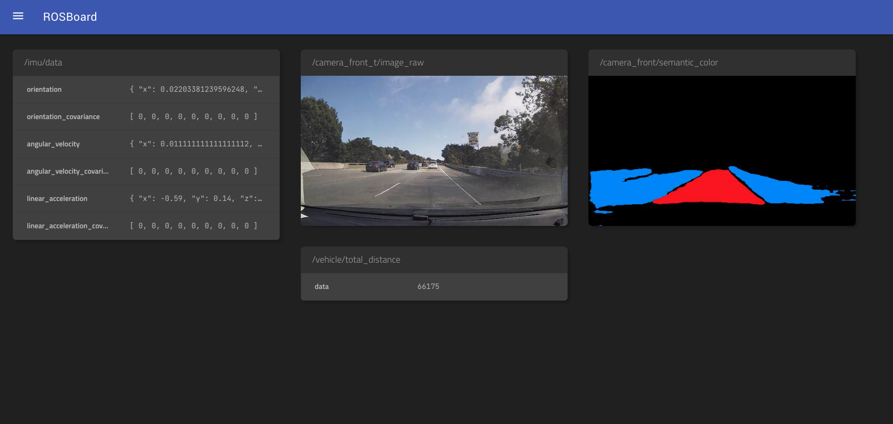
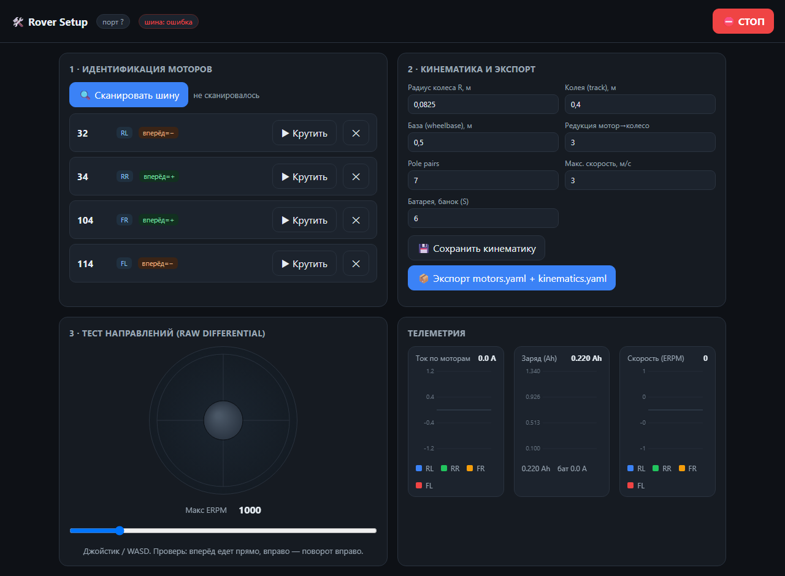

# Веб-интерфейсы GIGAROVER

Все интерфейсы открываются обычным браузером, ставить ничего не нужно.
В Wi-Fi сети ровера (SSID `GIGAROVER`) адрес платы — `10.42.0.1`
(работает и имя `rover.go`).

| Адрес | Что это | Когда работает |
| --- | --- | --- |
| `http://10.42.0.1:8765` | основная веб-морда (rover_web) | при живом ROS-стеке |
| `http://10.42.0.1:8767` | аварийный телеоп (rover-motord) | всегда |
| `http://10.42.0.1:8888` | rosboard — просмотр топиков | при живом ROS-стеке |
| `http://127.0.0.1:5000` | настройка моторов (rover-setup-web) | по SSH-туннелю, вне езды |

## Веб-морда rover_web — :8765

Главный интерфейс. Слева навигация по разделам, внизу — индикаторы
живости шлюза и ROS.



### Разделы

- **Главная** — стартовая страница, кнопки на rosboard и терминал.
- **ROS State** — живой граф: ноды, топики, сервисы; интроспекция и
  публикация в произвольный топик прямо из браузера (аккуратно!).
- **Движение** — вкладки «Управление» (телеоп: WASD на ПК, джойстик на
  телефоне, ползунки скоростей, аварийный STOP), «Маршруты» (конструктор
  шагов с предпросмотром и исполнением по одометрии), «Визуализация»
  (трек ровера на плоскости). Подробно — [driving.md](driving.md).


- **Периферия** — вкладки камеры (поток MJPEG, настройки), лидара,
  подсветки, аудио, октолайнера. На GIGAROVER актуальны камера и лидар
  (если подключены); остальные вкладки — наследие малого ровера и
  покажут «узел недоступен».
- **Хакатон** — раздача файлов заданий (markdown/HTML/PDF из каталога
  `hackathon_files_root`).
- **Терминал** — веб-терминал ttyd, если установлен и включён в конфиге
  (по умолчанию выключен).
- **Сервис** — вкладка «Диагностика»: сводные плитки (моторы, EKF,
  позиция, CPU/температура/RAM/диск), возраст потоков данных, полная
  таблица `/diagnostics` (статусы всех VESC и CAN-линка); вкладка
  «Настройки» — параметры узлов периферии.



> На скриншоте IMU показывает ERROR — это норма для GIGAROVER: IMU на
> нём не установлен, EKF работает по колёсной одометрии.

## Аварийный телеоп rover-motord — :8767

Самодостаточная страница демона ходовой. Живёт, пока жив демон — то есть
практически всегда (автозапуск + systemd-watchdog). Джойстик с неё
**перехватывает управление у ROS** (источник `web` приоритетнее) —
держите её открытой на телефоне как аварийный тормоз.


Сверху вниз: состояние демона и батареи (напряжение, заряд, мощность),
строка CAN-линка, четыре плитки колёс (скорость, eRPM, температура
силовых ключей, ток, частота телеметрии), ползунки скоростей, STOP
(блокирует движение на 0.75 с), джойстик. На ПК — WASD/стрелки,
пробел — STOP. Внизу — ссылка на сырой `/api/status`.

## rosboard — :8888

Вендорный просмотрщик топиков (проект dheera/rosboard): графики числовых
полей, сканы лидара, изображения камеры, `/diagnostics`, загрузка CPU —
всё в браузере, по клику на топик. Скриншоты интерфейса —
[в каталоге пакета](../src/rosboard/screenshots/).



## rover-setup-web — :5000 (настройка, не для езды)

Первичная привязка моторов: каким CAN ID какое колесо. Нужна при сборке
ровера, замене VESC или «колёса едут не туда». Владеет CAN-адаптером,
поэтому боевой стек на время настройки останавливается автоматически
(юниты конфликтуют):

```bash
sudo systemctl start rover-setup-web
ssh -L 5000:127.0.0.1:5000 ubuntu@10.42.0.1   # с рабочего ПК
# браузер: http://127.0.0.1:5000
```



Порядок: **Сканировать шину** → на каждом найденном ID нажать
**Крутить** и посмотреть, какое колесо крутится → назначить позицию
(FL/FR/RL/RR) и направление «вперёд» → проверить кинематику → джойстиком
прогнать драйв-тест → **Экспорт motors.yaml + kinematics.yaml**. После:

```bash
sudo systemctl stop rover-setup-web
sudo systemctl start rover-motord rover-bringup
```

> Бейдж «шина: ошибка» на скриншоте означает недоступный CAN-адаптер
> (снимок сделан без железа); на ровере с подключённым адаптером его
> быть не должно.

## Скриншоты

Все скриншоты в `docs/images/` сняты с настоящих интерфейсов из этого
репозитория; ходовая при этом работала в режиме симулятора
(`motord.py --sim`), веб-морда :8765 — на подставных данных шлюза,
поэтому цифры телеметрии иллюстративные.
